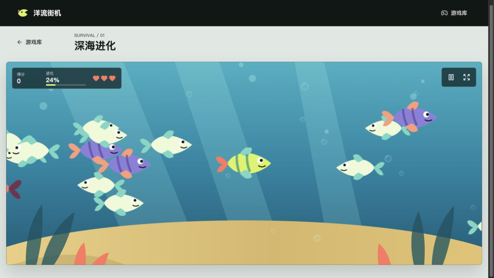
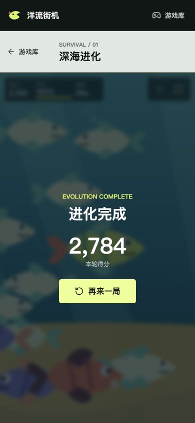

# 洋流街机

一个部署在 Cloudflare Workers 上的网页小游戏集合。当前包含首个可玩案例“深海进化”：控制鱼群中的小鱼，吞食更小的目标并避开大型捕食者。

## 当前界面





## 技术栈

- React + TypeScript：游戏大厅、路由和 HUD
- Phaser 3：游戏循环、输入、碰撞与场景生命周期
- Vite + Cloudflare Vite Plugin：本地开发和生产构建
- Cloudflare Workers Static Assets：静态资源、SPA 回退与 `/api/*`
- Vitest + ESLint：规则测试和质量检查
- GitHub Actions：PR 持续集成、`main` 自动部署

## 本地运行

需要 Node.js 22 或更高版本。

```bash
npm install
npm run assets:build
npm run dev
```

常用命令：

```bash
npm run lint
npm run typecheck
npm run test:run
npm run build
npm run deploy
```

游戏内保留可编辑 SVG 源素材，`npm run assets:build` 使用 Sharp 生成 Phaser 运行时加载的透明 PNG。

## 目录

```text
.
├── .github/workflows/ci.yml       # CI 与 Workers 部署
├── public/assets/                 # 原创游戏封面、场景和角色素材
├── src/
│   ├── app/                       # 应用入口与路由
│   ├── components/                # 大厅通用组件
│   ├── games/
│   │   ├── registry.ts            # 游戏清单
│   │   └── ocean-growth/
│   │       ├── core/              # 可单测的纯玩法规则
│   │       └── game/              # Phaser 场景与生命周期封装
│   ├── pages/                     # 大厅页面
│   └── styles/                    # 全局视觉样式
├── worker/index.ts                # Worker API 和资源回退
├── vite.config.ts
└── wrangler.jsonc
```

新增游戏时，为游戏建立独立目录，在 `src/games/registry.ts` 中注册元数据，再按路由懒加载页面。游戏之间不共享可变状态；真正重复的纯规则出现后，再抽取共享包。

## GitHub Actions 部署

仓库需要配置两个 Actions Secrets：

- `CLOUDFLARE_ACCOUNT_ID`
- `CLOUDFLARE_API_TOKEN`

API Token 只授予目标 Cloudflare 账户的 Workers 编辑权限。不要将 Token 写入仓库。PR 会执行 lint、类型检查、测试与生产构建；`main` 分支通过相同门禁后执行 `wrangler deploy`。Secrets 尚未配置时，部署步骤会明确跳过，质量门禁仍保持可用。

## Worker 路由

- 静态文件优先由 Cloudflare 全球缓存提供
- 未命中的前端路径回退到 SPA 的 `index.html`
- `/api/health` 由 Worker 执行
- 其他 `/api/*` 当前返回 JSON 404，后续可接 D1 排行榜和限流

## 许可证

项目代码和仓库内原创 SVG 素材使用 [MIT License](./LICENSE)。调研过的第三方仓库没有复制进本项目，记录见 [docs/research.md](./docs/research.md)。
